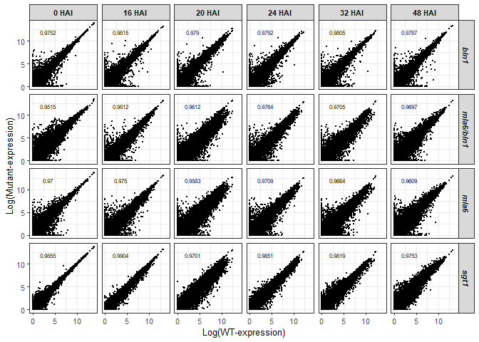

Genome-wide expression matrix
================
Valeria Velasquez-Zapata
2/4/2022

This notebook contains code to make an expression matrix comparing a
wild type genitype with a series of mutants, and calculate their Pearson
correlation

## Dataset description

The transcriptome under analysis is a time course of 6 timepoints, 5
barley genotypes infected with *Blumeria graminis* fsp *hordei* and
three biological replicates for a total of 90 samples.

There are 3 barley gene mutations associated with this dynamic
transcription. *Mla6* which is a NLR receptor that confers reisstance to
the disease. *Bln1* is a negative regulator of immune signaling and the
resistant bln1 mutant exhibits enhanced basal defense. *Rar3* (required
for *Mla6* resistance3) is required for MLA6-mediated generation of H2O2
and the hypersensitive response. The susceptible rar3 mutant contains an
in-frame Lys-Leu deletion in the SGT1-specific domain, which interacts
with NLR proteins.Five genotypes were included in the design, including
the resistant wild type progenitor CI 16151 (*Mla6, Bln1, Sgt1*)
carrying the Mla6 allele and four fast-neutron, immune-signaling
mutants: one resistant – bln1-m19089 (*Mla6, bln1, Sgt1*), and three
susceptible – mla6-m18982 (*mla6, Bln1, Sgt1*), rar3-m11526 (*Mla6,
Bln1, Sgt1ΔKL308-309*), and the double mutant – (mla6+bln1)-m19028
(mla6, bln1, Sgt1)

The objective of this work is to define functions to determine epistatic
relationships between *Mla6* and *Bln1* and gene effects between *Mla6*
and *Rar3*.

We start by defining the experimental design variables and a fucntion
for differential expression

``` r
library(stringr)
library(reshape2)
library(tidyverse)
```

    ## -- Attaching packages --------------------------------------- tidyverse 1.3.1 --

    ## v ggplot2 3.3.5     v purrr   0.3.4
    ## v tibble  3.1.0     v dplyr   1.0.5
    ## v tidyr   1.1.3     v forcats 0.5.1
    ## v readr   1.4.0

    ## -- Conflicts ------------------------------------------ tidyverse_conflicts() --
    ## x dplyr::filter() masks stats::filter()
    ## x dplyr::lag()    masks stats::lag()

``` r
expression <- read.csv("data/hv_R3_genes_norm_counts_de_tax_sp.csv", stringsAsFactors = F)

gi = expression[,2:91]
gi = log(expression[,2:91]+1)

rownames(gi)<- expression$gene

# Calculating means for gi
gmeans = matrix(nrow = nrow(gi), ncol=30)
gmeans<- data.frame(gmeans)
j = 1
for(k in 1:30){
  gmeans[,k] = rowMeans((gi[,j:(j+2)]))
  colnames(gmeans)[k]<- str_sub(colnames(gi)[j], end=-4)
  j = j+3
}
rm(j, k, gi)

# Reading in means for genotype, depending on the order in the table

# For V2 new annotation 
means.bln1.norm = gmeans[,19:24]
means.dm.norm = gmeans[,25:30]
means.mla6.norm = gmeans[,7:12]
means.rar3.norm = gmeans[,13:18]
means.wt.norm = gmeans[,1:6]

gmeans$gene<- expression$gene
gmeans_long<- melt(gmeans,id.vars = "gene")
gmeans_long$genotype<- sapply(gmeans_long$variable, FUN=function(x)str_split(x,"_")[[1]][1])
gmeans_long$timepoint<- sapply(gmeans_long$variable, FUN=function(x)str_split(x,"_")[[1]][2])
gmeans_long$WT_value<- rep(gmeans_long$value[gmeans_long$genotype=="wt"], 5)

#str_sub(gmeans_long$variable, end=-4)
genotype_labels<- c("bln1", "mla6/bln1", "mla6", "sgt1")
names(genotype_labels)<- c("bln1", "dm", "mla6", "rar3")
timepoint_labels<-c("0 HAI", "16 HAI", "20 HAI", "24 HAI", "32 HAI", "48 HAI")
names(timepoint_labels)<- c("t0", "t16", "t20", "t24", "t32", "t48")
```

Now lets calculate some correlations

``` r
gmean_long_mutants<- gmeans_long[gmeans_long$genotype!="wt",]
correlations<- gmean_long_mutants %>% group_by(genotype, timepoint) %>% summarise(cor=cor(value, WT_value))
```

    ## `summarise()` has grouped output by 'genotype'. You can override using the `.groups` argument.

``` r
correlations$cor<- round(correlations$cor, digits = 4)
```

## Matrix

``` r
ggplot(gmeans_long[gmeans_long$genotype!="wt",], aes(x=WT_value, y=value)) +
  geom_point(size=0.5) +  facet_grid(genotype~timepoint, labeller = labeller(genotype = genotype_labels, timepoint = timepoint_labels)) + theme_bw(base_size = 10) + 
  theme(strip.text.y = element_text(face = "bold.italic"), strip.text.x = element_text(face = "bold")) + xlab("Log(WT-expression)") + ylab("Log(Mutant-expression)") + 
  geom_text(x = 3.5, y = 12,data=correlations, aes(label = cor), size=2)
```

<!-- -->
