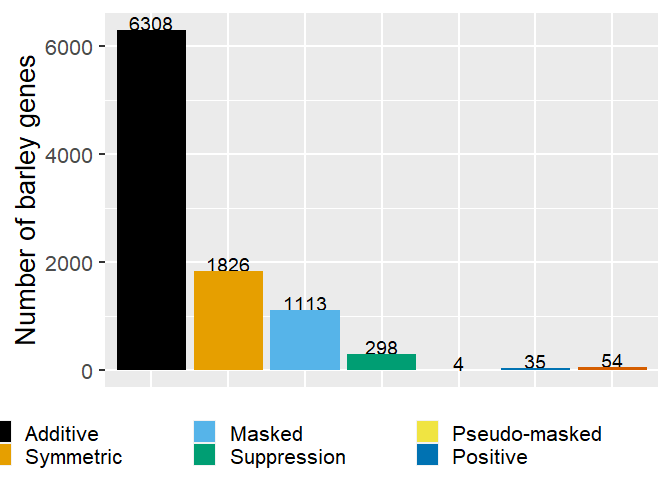

Transcriptome epistasis model
================
Valeria Velasquez-Zapata
2/4/2022

## Dataset description

The transcriptome under analysis is a time course of 6 timepoints, 5
barley genotypes infected with *Blumeria graminis* fsp *hordei* and
three biological replicates for a total of 90 samples.

There are 3 barley gene mutations associated with this dynamic
transcription. *Mla6* which is a NLR receptor that confers reisstance to
the disease. *Bln1* is a negative regulator of immune signaling and the
resistant bln1 mutant exhibits enhanced basal defense. *Rar3* (required
for *Mla6* resistance3) is required for MLA6-mediated generation of H2O2
and the hypersensitive response. The susceptible rar3 mutant contains an
in-frame Lys-Leu deletion in the SGT1-specific domain, which interacts
with NLR proteins.Five genotypes were included in the design, including
the resistant wild type progenitor CI 16151 (*Mla6, Bln1, Sgt1*)
carrying the Mla6 allele and four fast-neutron, immune-signaling
mutants: one resistant – bln1-m19089 (*Mla6, bln1, Sgt1*), and three
susceptible – mla6-m18982 (*mla6, Bln1, Sgt1*), rar3-m11526 (*Mla6,
Bln1, Sgt1ΔKL308-309*), and the double mutant – (mla6+bln1)-m19028
(mla6, bln1, Sgt1)

The objective of this work is to define functions to determine epistatic
relationships between *Mla6* and *Bln1* and gene effects between *Mla6*
and *Rar3*.

We start by defining the experimental design variables and a fucntion
for differential expression

``` r
time=c(0, 16, 20, 24, 32, 48)
gen=c("wt", "mla6", "rar3","bln1", "dm")
combi <-combn(c("wt", "mla6", "rar3","bln1", "dm"),2)
comb<- apply(combi, 2, FUN=function(x)paste0(x[1],"_", x[2]))
FC_padj_table<- read.csv("data/hv_R3_genes_deseq2_results_pairwise_genotype_logfc_padj_tax_sp.csv")
FC_padj_table[,grep("FoldChange", colnames(FC_padj_table))][is.na(FC_padj_table[,grep("FoldChange", colnames(FC_padj_table))])]<- 0
FC_padj_table[,grep("padj", colnames(FC_padj_table))][is.na(FC_padj_table[,grep("padj", colnames(FC_padj_table))])]<- 1

#create a function that compares using the 2 genotypes, and p value, report with FC and fix by num and den, and if DE or !DE

DE_list<- function(DE_table, num, den, padj, DE=T, FC=0, comb, times){
  library(textclean)
  if(paste0(num, "_", den) %in% comb){
    DE_table_mod<- DE_table[, c(1, grep(paste(paste0(num, "_", den), collapse = "|"), colnames(DE_table)))]
  }else{
    DE_table_mod<- DE_table[, c(1, grep(paste(paste0(den, "_", num), collapse = "|"), colnames(DE_table)))]
    DE_table_mod[, grep("FoldChange", colnames(DE_table_mod))]<- -DE_table_mod[, grep("FoldChange", colnames(DE_table_mod))]
    colnames(DE_table_mod)<- swap(colnames(DE_table_mod), num, den)
  }
  #DE_table_mod<- DE_table_mod[complete.cases(DE_table_mod),]
  result<- list()
  for(t in times){
    if(DE==T){
      if(FC>0){
        result[[paste0("t",t)]]<- DE_table_mod[DE_table_mod[,paste0("t",t,"_", num, "_", den,"_padj")]< padj &
                                                 DE_table_mod[,paste0("t",t,"_", num, "_", den,"_log2FoldChange")] > 0, c(1, grep(paste0("t",t,"_", num, "_", den), colnames(DE_table_mod)))]
      }else if(FC<0){
        result[[paste0("t",t)]]<- DE_table_mod[DE_table_mod[,paste0("t",t,"_", num, "_", den,"_padj")]< padj &
                                                 DE_table_mod[,paste0("t",t,"_", num, "_", den,"_log2FoldChange")] < 0, c(1, grep(paste0("t",t,"_", num, "_", den), colnames(DE_table_mod)))]
      }else{
        result[[paste0("t",t)]]<- DE_table_mod[DE_table_mod[,paste0("t",t,"_", num, "_", den,"_padj")]< padj, c(1, grep(paste0("t",t,"_", num, "_", den), colnames(DE_table_mod)))]
      }
    }else{
      result[[paste0("t",t)]]<- DE_table_mod[DE_table_mod[,paste0("t",t,"_", num, "_", den,"_padj")]> padj, c(1, grep(paste0("t",t,"_", num, "_", den), colnames(DE_table_mod)))]
      #result[[paste0("t",t)]]<- result[[paste0("t",t)]][!duplicated(result[[paste0("t",t)]]$gene),]
    }
    #result[[paste0("t",t)]]<- result[[paste0("t",t)]][!is.na(result[[paste0("t",t)]]$gene),]
  }
  return(result)
}
```

After this, we define two functions to work with gene lists (intersect,
minus and union) and determine the epistatic effects

``` r
set_operations<- function(list1, list2, operation="intersection"){
  result<- list()
  if(operation=="intersection"){
    for(t in names(list1)){
      result[[t]]<- list1[[t]][list1[[t]]$gene %in% list2[[t]]$gene, ]
      if(sum(!colnames(list2[[t]]) %in% colnames(list1[[t]]))>0){
        result[[t]]<- cbind(result[[t]], list2[[t]][match(result[[t]]$gene, list2[[t]]$gene),-grep(paste(colnames(list1[[t]]), collapse = "|"), colnames(list2[[t]]))])
      }
    }
  }else if(operation=="minus"){
    for(t in names(list1)){
      result[[t]]<- list1[[t]][!list1[[t]]$gene %in% list2[[t]]$gene, ]
    }
  }else if(operation=="union"){
    library(dplyr)
    for(t in names(list1)){
      common_genes<- list1[[t]][list1[[t]]$gene %in% list2[[t]]$gene, "gene"]
      result[[t]]<- bind_rows(merge(list1[[t]][list1[[t]]$gene %in% common_genes, ], list2[[t]][match(common_genes, list2[[t]]$gene),], by=colnames(list1[[t]])[colnames(list1[[t]]) %in% colnames(list2[[t]])]),
                              list1[[t]][!list1[[t]]$gene %in% common_genes, ], list2[[t]][!list2[[t]]$gene %in% common_genes, ])
    }
  }
  return(result)
}

get_epistatic<-function(triple_union_list, thr=1){
  result<- triple_union_list
  result_notEpi<-list()
  for(t in names(result)){
    result[[t]][,grep("FoldChange", colnames(result[[t]]))][is.na(result[[t]][,grep("FoldChange", colnames(result[[t]]))])]<- 0
    result[[t]]$expected<-result[[t]][,4]+result[[t]][,6]
    result[[t]]$deviation<-result[[t]][,2]-result[[t]][,4]-result[[t]][,6]
    result[[t]]$dev_prop<-abs(result[[t]]$deviation/(result[[t]][,2]+0.1))
    result_notEpi[[t]]<- result[[t]][abs(result[[t]]$deviation)<thr,]
    result[[t]]<- result[[t]][abs(result[[t]]$deviation)>thr,]
    # result_notEpi[[t]]<- result[[t]][result[[t]]$dev_prop<thr,]
    # result[[t]]<- result[[t]][result[[t]]$dev_prop>thr,]
  }
  return(list(result,result_notEpi))
}
```

## Model

We calculate all the effects

``` r
horvu_DE_table<- FC_padj_table
#Mla6 and Rar3
wt_mla6_DE<- DE_list(DE_table=horvu_DE_table, num="wt", den="mla6", padj=0.001, DE=T, comb=comb, times=time)
wt_rar3_DE<- DE_list(DE_table=horvu_DE_table, num="wt", den="rar3", padj=0.001, DE=T, comb=comb, times=time)
mla6_rar3_notDE<- DE_list(DE_table=horvu_DE_table, num="mla6", den="rar3", padj=0.001, DE=F, comb=comb, times=time)
mla6_rar3_DE_FC_plus<-DE_list(DE_table=horvu_DE_table, num="mla6", den="rar3", padj=0.001, DE=T, FC=1, comb=comb, times=time)
mla6_rar3_DE_FC_minus<-DE_list(DE_table=horvu_DE_table, num="mla6", den="rar3", padj=0.001, DE=T, FC=-1, comb=comb, times=time)

shared_eff_Mla6_Rar3<- set_operations(list1=wt_mla6_DE, list2=wt_rar3_DE, operation="intersection")
unique_eff_Mla6<- set_operations(list1=wt_mla6_DE, list2=shared_eff_Mla6_Rar3, operation="minus")
unique_eff_Rar3<- set_operations(list1=wt_rar3_DE, list2=shared_eff_Mla6_Rar3, operation="minus")

equal_eff_Mla6_Rar3<- set_operations(list1=shared_eff_Mla6_Rar3, list2=mla6_rar3_notDE, operation="intersection")
predominant_Mla6<- set_operations(list1=shared_eff_Mla6_Rar3, list2=mla6_rar3_DE_FC_plus, operation="intersection")
predominant_Rar3<- set_operations(list1=shared_eff_Mla6_Rar3, list2=mla6_rar3_DE_FC_minus, operation="intersection")


#Mla6 and Bln1
wt_mla6_DE<- DE_list(DE_table=horvu_DE_table, num="wt", den="mla6", padj=0.001, DE=T, comb=comb, times=time)
wt_bln1_DE<- DE_list(DE_table=horvu_DE_table, num="wt", den="bln1", padj=0.001, DE=T, comb=comb, times=time)
wt_dm_DE<- DE_list(DE_table=horvu_DE_table, num="wt", den="dm", padj=0.001, DE=T, comb=comb, times=time)

mla6_bln1_notDE<- DE_list(DE_table=horvu_DE_table, num="mla6", den="bln1", padj=0.001, DE=F, comb=comb, times=time)
mla6_dm_notDE<- DE_list(DE_table=horvu_DE_table, num="mla6", den="dm", padj=0.001, DE=F, comb=comb, times=time)
bln1_dm_notDE<- DE_list(DE_table=horvu_DE_table, num="bln1", den="dm", padj=0.001, DE=F, comb=comb, times=time)

#shared_eff_Mla6_Bln1<- set_operations(list1=wt_mla6_DE, list2=wt_bln1_DE, operation="intersection")
#shared_eff_Mla6_Bln1<- set_operations(list1=shared_eff_Mla6_Bln1, list2=mla6_bln1_notDE, operation="intersection")
epi_Mla6_Bln1<-set_operations(list1=wt_dm_DE, list2=wt_mla6_DE, operation="union")
```

    ## 
    ## Attaching package: 'dplyr'

    ## The following objects are masked from 'package:stats':
    ## 
    ##     filter, lag

    ## The following objects are masked from 'package:base':
    ## 
    ##     intersect, setdiff, setequal, union

``` r
epi_Mla6_Bln1<-set_operations(list1=epi_Mla6_Bln1, list2=wt_bln1_DE, operation="union")
epi_Mla6_Bln1_all<- get_epistatic(epi_Mla6_Bln1, thr = 1)
epi_Mla6_Bln1<-epi_Mla6_Bln1_all[[1]]
additive_Mla6_Bln1<-epi_Mla6_Bln1_all[[2]]

mla6_dm_DE_FC_plus<- DE_list(DE_table=horvu_DE_table, num="mla6", den="dm", padj=0.001, DE=T, FC=1, comb=comb, times=time)
mla6_dm_DE_FC_minus<- DE_list(DE_table=horvu_DE_table, num="mla6", den="dm", padj=0.001, DE=T, FC=-1, comb=comb, times=time)


bln1_dm_DE_FC_plus<- DE_list(DE_table=horvu_DE_table, num="bln1", den="dm", padj=0.001, DE=T, FC=1, comb=comb, times=time)
bln1_dm_DE_FC_minus<- DE_list(DE_table=horvu_DE_table, num="bln1", den="dm", padj=0.001, DE=T, FC=-1, comb=comb, times=time)

positive<- set_operations(list1=epi_Mla6_Bln1, list2=bln1_dm_DE_FC_minus, operation="intersection")
positive<- set_operations(list1=positive, list2=mla6_dm_DE_FC_minus, operation="intersection")

pseudo_masked<- set_operations(list1=epi_Mla6_Bln1, list2=bln1_dm_DE_FC_plus, operation="intersection")
pseudo_masked<- set_operations(list1=pseudo_masked, list2=mla6_dm_DE_FC_minus, operation="intersection")

negative<- set_operations(list1=epi_Mla6_Bln1, list2=bln1_dm_DE_FC_plus, operation="intersection")
negative<- set_operations(list1=negative, list2=mla6_dm_DE_FC_plus, operation="intersection")


masked<- set_operations(list1=epi_Mla6_Bln1, list2=mla6_dm_notDE, operation="intersection")
suppression<- set_operations(list1=epi_Mla6_Bln1, list2=bln1_dm_notDE, operation="intersection")

#If we want to separate further symmetric interaction and remove those from masked and suppression
symmetric<- set_operations(list1=masked, list2=suppression, operation="intersection")
masked<- set_operations(list1=masked, list2=symmetric, operation="minus")
suppression<- set_operations(list1=suppression, list2=symmetric, operation="minus")

#intersections
#make a function to classify the genes with the epistasis patters by timepoint
#find if one gene has more than one pattern

combine_lists<- function(oldlist){
  library(data.table)
  new_list<- list()
  for (name in names(oldlist)) {
    if(nrow(oldlist[[name]]>0)){
      new_list[[name]]<- data.frame(gene=oldlist[[name]]$gene, time=name, epistasis=deparse(substitute(oldlist)))
    }
  }
  combined<- rbindlist(new_list)
  return(combined)
}

#shared_Mla6_Rar3<- combine_lists(shared_eff_Mla6_Rar3)
unique_Mla6<- combine_lists(unique_eff_Mla6)
```

    ## 
    ## Attaching package: 'data.table'

    ## The following objects are masked from 'package:dplyr':
    ## 
    ##     between, first, last

``` r
unique_Rar3<- combine_lists(unique_eff_Rar3)
equal_Mla6_Rar3<- combine_lists(equal_eff_Mla6_Rar3)
predom_Mla6<- combine_lists(predominant_Mla6)
predom_Rar3<- combine_lists(predominant_Rar3)

library(tidyverse)
```

    ## -- Attaching packages --------------------------------------- tidyverse 1.3.1 --

    ## v ggplot2 3.3.5     v purrr   0.3.4
    ## v tibble  3.1.0     v stringr 1.4.0
    ## v tidyr   1.1.3     v forcats 0.5.1
    ## v readr   1.4.0

    ## -- Conflicts ------------------------------------------ tidyverse_conflicts() --
    ## x data.table::between() masks dplyr::between()
    ## x dplyr::filter()       masks stats::filter()
    ## x data.table::first()   masks dplyr::first()
    ## x dplyr::lag()          masks stats::lag()
    ## x data.table::last()    masks dplyr::last()
    ## x purrr::transpose()    masks data.table::transpose()

``` r
#combined_tables_Mla6_Rar3<- rbind(shared_Mla6_Rar3,unique_Mla6, unique_Rar3, equal_Mla6_Rar3, predom_Mla6, predom_Rar3)
combined_tables_Mla6_Rar3<- rbind(unique_Mla6, unique_Rar3, equal_Mla6_Rar3, predom_Mla6, predom_Rar3)
#combined_tables_Mla6_Rar3<- combined_tables_Mla6_Rar3 %>% group_by(gene, time) %>% summarise(epistasis = paste0(epistasis, collapse = ";"))
spread_tables_Mla6_Rar3<- spread(combined_tables_Mla6_Rar3, key = time, value = epistasis)
summary_barley_Mla6_Rar3<- t(rbindlist(sapply(X = spread_tables_Mla6_Rar3[,-1], FUN=function(x)data.frame(as.list(table(x)))), fill = TRUE))
colnames(summary_barley_Mla6_Rar3)<- paste0("t", time)
#summary_barley_Mla6_Rar3<- sapply(X = spread_tables_Mla6_Rar3[,-1], FUN = table)


addi_Mla6_Bln1<- combine_lists(additive_Mla6_Bln1)
pos<- combine_lists(positive)
pseudo<- combine_lists(pseudo_masked)
neg<- combine_lists(negative)
masked_epi<- combine_lists(masked)
supp<- combine_lists(suppression)
symmetric_Mla6_Bln1<- combine_lists(symmetric)

#combined_tables_Mla6_Bln1<- rbind(addi_Mla6_Bln1, pos, pseudo, neg, masked_epi, supp)
combined_tables_Mla6_Bln1<- rbind(addi_Mla6_Bln1, pos, pseudo, neg, masked_epi, supp, symmetric_Mla6_Bln1)
combined_tables_Mla6_Bln1<- combined_tables_Mla6_Bln1 %>% group_by(gene, time) %>% summarise(epistasis = paste0(epistasis, collapse = ";"))
```

    ## `summarise()` has grouped output by 'gene'. You can override using the `.groups` argument.

``` r
spread_tables_Mla6_Bln1<- spread(combined_tables_Mla6_Bln1, key = time, value = epistasis)

summary_barley_Mla6_Bln1<- sapply(X = spread_tables_Mla6_Bln1[,-1], FUN = table)


#spread_tables_Mla6_Bln1[spread_tables_Mla6_Bln1=="additive_Mla6_Bln1"]<-NA
spread_tables_Mla6_Bln1$consensus<- apply(spread_tables_Mla6_Bln1[,3:7], 1, 
                                          FUN=function(x){y=table(unlist(x)) 
                                          paste(names(y)[which(y==max(y))], collapse = ";")})

spread_tables_Mla6_Rar3$consensus<- apply(spread_tables_Mla6_Rar3[,3:7], 1, 
                                          FUN=function(x){y=table(unlist(x)) 
                                          paste(names(y)[which(y==max(y))], collapse = ";")})
```

## Save the lists

If we want to svae the epistasis lists we use

``` r
save_lists<- function(list, path){
  for (name in names(list)) {
    if(nrow(list[[name]]>0)){
      write.csv(list[[name]], paste0(path, name,"_",deparse(substitute(list)),".csv"), row.names = F)
    }}
  saveRDS(list, paste0(path, deparse(substitute(list)),".RDS"))
}
```

## Visualization

Let’s create some barplots with the distribution of the epistatic genes
over time and a consensus

``` r
spread_tables_Mla6_Bln1<- spread_tables_Mla6_Bln1[spread_tables_Mla6_Bln1$consensus!="", ]
consensus_barley_Mla6_Bln1<- data.frame(table(spread_tables_Mla6_Bln1$consensus))
consensus_barley_Mla6_Bln1<- consensus_barley_Mla6_Bln1 %>%  mutate(Type = strsplit(as.character(Var1), ";")) %>% unnest(Type) %>% 
  group_by(Type) %>% summarise(freq= sum(Freq))

consensus_barley_Mla6_Rar3<- data.frame(table(spread_tables_Mla6_Rar3$consensus))
consensus_barley_Mla6_Rar3<- consensus_barley_Mla6_Rar3 %>%  mutate(Type = strsplit(as.character(Var1), ";")) %>% unnest(Type) %>% 
  group_by(Type) %>% summarise(freq= sum(Freq))

consensus_barley_Mla6_Bln1$Type<- factor(consensus_barley_Mla6_Bln1$Type, 
                                         levels = c("additive_Mla6_Bln1", "symmetric", "masked", "suppression", "pseudo_masked", "positive", "negative"),
                                         labels = c("Additive", "Symmetric", "Masked", "Suppression", "Pseudo-masked", "Positive", "Negative"))
consensus_barley_Mla6_Rar3$Type<- factor(consensus_barley_Mla6_Rar3$Type, 
                                         levels = c( "unique_eff_Mla6", "unique_eff_Rar3", "equal_eff_Mla6_Rar3", "predominant_Mla6", "predominant_Rar3"),
                                         labels = c("Dominant Mla6", "Dominant Rar3", "Equal Mla6, Rar3", "Predominant Mla6", "Predominant Rar3"))

summary_barley_Mla6_Bln1<- read.csv("~/iowa_state/lab/RNAseq/RNASeq_paper/vvz manuscript/analysis/epistasis_lists/barley/HVR3/summary_barley_Mla6_Bln1.csv")
colnames(summary_barley_Mla6_Bln1)[1]<- "Type"
summary_barley_Mla6_Rar3<- read.csv("~/iowa_state/lab/RNAseq/RNASeq_paper/vvz manuscript/analysis/epistasis_lists/barley/HVR3/summary_barley_Mla6_Rar3.csv")
colnames(summary_barley_Mla6_Rar3)[1]<- "Type"

summary_barley_Mla6_Bln1<- gather(data = summary_barley_Mla6_Bln1, key = "time", value="freq",2:7)

summary_barley_Mla6_Rar3<- gather(data = summary_barley_Mla6_Rar3, key = "time", value="freq",2:7)
summary_barley_Mla6_Rar3[is.na(summary_barley_Mla6_Rar3$freq), "freq"]<- 0
summary_barley_Mla6_Rar3$Type<- factor(summary_barley_Mla6_Rar3$Type, 
                                       levels = c( "unique_eff_Mla6", "unique_eff_Rar3", "equal_eff_Mla6_Rar3", "predominant_Mla6", "predominant_Rar3"),
                                       labels = c("Dominant Mla6", "Dominant Rar3", "Equal Mla6, Rar3", "Predominant Mla6", "Predominant Rar3"))
summary_barley_Mla6_Bln1$Type<- factor(summary_barley_Mla6_Bln1$Type, 
                                       levels = c("additive_Mla6_Bln1", "symmetric", "masked", "suppression", "pseudo_masked", "positive", "negative"),
                                       labels = c("Additive", "Symmetric", "Masked", "Suppression", "Pseudo-masked", "Positive", "Negative"))


#barplot of patterns
#barley
#getPalette = c("#E69F00", "#009E73", "#F0E442", "#0072B2", "#D55E00", "#CC79A7", "#56B4E9", "#000000")
#benchmarking<- read.csv("~/iowa_state/lab/Y2H publication/plos comp biol submission/second/figures_mla_version/benchmarking.csv")
#benchmarking$Reference<- factor(benchmarking$Reference, levels = c("Erffelinck et al. 2018", "Pashkova et al. 2016",   "Yachie et al. 2016", "Schlecht et al. 2017",   "Yang et al. 2018"))

getPalette  <- c("#000000", "#E69F00", "#56B4E9", "#009E73", "#F0E442", "#0072B2", "#D55E00", "#CC79A7")

ggplot(summary_barley_Mla6_Bln1, aes(x=Type, y=freq, group=time, fill=Type)) +
  geom_text(aes(label=freq),hjust=0.5, vjust=0, size=3) +geom_bar(stat="identity") + 
  scale_color_manual(values = getPalette, labels= c("Additive", "Symmetric", "Masked", "Suppression", "Pseudo-masked", "Positive", "Negative"))+ 
  scale_fill_manual(values = getPalette, labels= c("Additive", "Symmetric", "Masked", "Suppression", "Pseudo-masked", "Positive", "Negative"))+
  facet_wrap(~time, ncol = 3, scales = "free_y") + theme_grey(base_size = 10) + xlab("Type") +ylab("Number of barley genes") + 
  theme(axis.title.x=element_blank(), axis.text.x=element_blank(), axis.ticks.x=element_blank(), strip.text.y = element_text(angle = 0), legend.position="bottom", 
        legend.text = element_text(margin = margin(r = 1.5, unit = "cm")),legend.margin = margin(l=0, unit="cm"))
```

<!-- -->

``` r
ggplot(consensus_barley_Mla6_Bln1, aes(x=Type, y=freq, fill=Type)) +
  geom_text(aes(label=freq),hjust=0.5, vjust=0, size=5) +geom_bar(stat="identity") + 
  scale_color_manual(values = getPalette, labels= c("Additive", "Symmetric", "Masked", "Suppression", "Pseudo-masked", "Positive", "Negative"))+ 
  scale_fill_manual(values = getPalette, labels= c("Additive", "Symmetric", "Masked", "Suppression", "Pseudo-masked", "Positive", "Negative"))+
  theme_grey(base_size = 20) + xlab("Type") +ylab("Number of barley genes") + 
  theme(axis.title.x=element_blank(), axis.text.x=element_blank(), axis.ticks.x=element_blank(), strip.text.y = element_text(angle = 0), legend.position="bottom", 
        legend.text = element_text(margin = margin(r = 1.5, unit = "cm")),legend.margin = margin(l=0, unit="cm"))
```

<!-- -->

``` r
#Rar3
#getPalette = c("#FDE725FF","#21908CFF","#440154FF",  "#5DC863FF", "#3B528BFF")
getPalette = c("#00AFBB", "#E7B800", "#FC4E07", "#52854C", "#7570B3")
ggplot(summary_barley_Mla6_Rar3, aes(x=Type, y=freq, group=time, fill=Type)) +
  geom_text(aes(label=freq),hjust=0.5, vjust=0, size=3) +geom_bar(stat="identity") + 
  scale_color_manual(values = getPalette, labels= c("Dominant Mla6", "Dominant Rar3", "Equal Mla6, Rar3", "Predominant Mla6", "Predominant Rar3"))+ 
  scale_fill_manual(values = getPalette, labels= c("Dominant Mla6", "Dominant Rar3", "Equal Mla6, Rar3", "Predominant Mla6", "Predominant Rar3"))+
  facet_wrap(~time, ncol = 3, scales = "free_y") + theme_grey(base_size = 10) + xlab("Type") +ylab("Number of barley genes") + scale_y_continuous(trans='sqrt')+ 
  theme(axis.title.x=element_blank(), axis.text.x=element_blank(), axis.ticks.x=element_blank(), strip.text.y = element_text(angle = 0), legend.position="bottom", 
        legend.text = element_text(margin = margin(r = 1.5, unit = "cm")), legend.margin = margin(l=0, unit="cm"))
```

<!-- -->

``` r
ggplot(consensus_barley_Mla6_Rar3, aes(x=Type, y=freq, fill=Type)) +
  geom_text(aes(label=freq),hjust=0.5, vjust=0, size=5) +geom_bar(stat="identity") + 
  scale_color_manual(values = getPalette, labels= c("Dominant Mla6", "Dominant Rar3", "Equal Mla6, Rar3", "Predominant Mla6", "Predominant Rar3"))+ 
  scale_fill_manual(values = getPalette, labels= c("Dom Mla6", "Dom Rar3", "Equal", "Pred Mla6", "Pred Rar3"))+
  theme_grey(base_size = 20) + xlab("Type") +ylab("Number of barley genes") + scale_y_continuous(trans='sqrt')+ 
  theme(axis.title.x=element_blank(), axis.text.x=element_blank(), axis.ticks.x=element_blank(), strip.text.y = element_text(angle = 0))
```

<!-- -->
