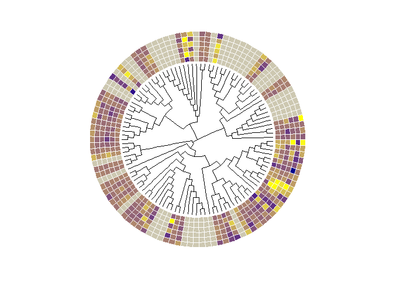

Tree\_with\_heatmap
================
Valeria Velasquez-Zapata
2/6/2022

This notebook contains code to make a phylogenetic tree with a heatmap
using ggtree

## Dataset description

This project contains a phylogenetic tree of the homeobox familly in
barley and a set of log1 foldchanges in their expression dataset

## Functions

We create a funcuton to assign colors to foldchange values

``` r
if (!requireNamespace("BiocManager", quietly = TRUE))
  install.packages("BiocManager")
BiocManager::install("ggtree")
```

    ## package 'ggtree' successfully unpacked and MD5 sums checked
    ## 
    ## The downloaded binary packages are in
    ##  C:\Users\Valeria\AppData\Local\Temp\RtmpyekDUd\downloaded_packages

``` r
library(ggtree)
library(tidyverse)
homeobox_complete_muscle <- read.tree("data/homeobox_tree_muscle.nwk")

FC<- read.csv("data/hv_R2_genes_deseq2_results_pairwise_genotype_logfc_tax_sp.csv",
              stringsAsFactors = F, row.names = 1)
FC<- FC[rownames(FC) %in% homeobox_complete_muscle$tip.label,grep("wt_mla6", colnames(FC))]
#write.csv(FC, "data/hv_R2_genes_deseq2_results_pairwise_genotype_logfc_tax_sp.csv")

#for the mean
make_heatmap_table <- function(FC_table, tree){
  wt_log<- FC_table[match(tree$tip.label,rownames(FC_table)), ]
  colnames(wt_log)<- c("0","16","20", "24", "32", "48")
  wt_log[wt_log<= -3] <- -3
  wt_log[wt_log>= 3] <- 3
  #converting the decimals to colors 
  wt_log_scaled <- ((wt_log-min(wt_log, na.rm=TRUE))/(max(wt_log, na.rm=TRUE)- min(wt_log, na.rm=TRUE)))
  require(scales)
  library(munsell)
  wt_log_scaled$`0` <- seq_gradient_pal("darkblue", "yellow")(wt_log_scaled$`0`)
  wt_log_scaled$`16` <- seq_gradient_pal("darkblue", "yellow")(wt_log_scaled$`16`)
  wt_log_scaled$`20` <- seq_gradient_pal("darkblue", "yellow")(wt_log_scaled$`20`)
  wt_log_scaled$`24` <- seq_gradient_pal("darkblue", "yellow")(wt_log_scaled$`24`)
  wt_log_scaled$`32` <- seq_gradient_pal("darkblue", "yellow")(wt_log_scaled$`32`)
  wt_log_scaled$`48` <- seq_gradient_pal("darkblue", "yellow")(wt_log_scaled$`48`)
  
  # here we will combine the blast hit and expression data and put gray on the blanks for expression
  row.names(wt_log_scaled) <- tree$tip.label
  wt_log_scaled[is.na(wt_log_scaled)] <- "#CDC8B1"
  colors_heatmap <- unique(as.vector(t(wt_log_scaled)))
  names(colors_heatmap) = unique(as.vector(t(wt_log_scaled)))
  return(list(wt_log_scaled, colors_heatmap))
}
```

``` r
homeobox_complete_muscle_circ <- ggtree(homeobox_complete_muscle, layout="circular",
                                        branch.length="none") 
heatmap_muscle_homeobox <- make_heatmap_table(FC_table=FC, tree= homeobox_complete_muscle)

#plots

gheatmap(p=homeobox_complete_muscle_circ, data=heatmap_muscle_homeobox[[1]], 
         offset = 0, width=0.4, colnames = FALSE) +
  scale_fill_manual(values=heatmap_muscle_homeobox[[2]],guide=FALSE)
```

<!-- -->
